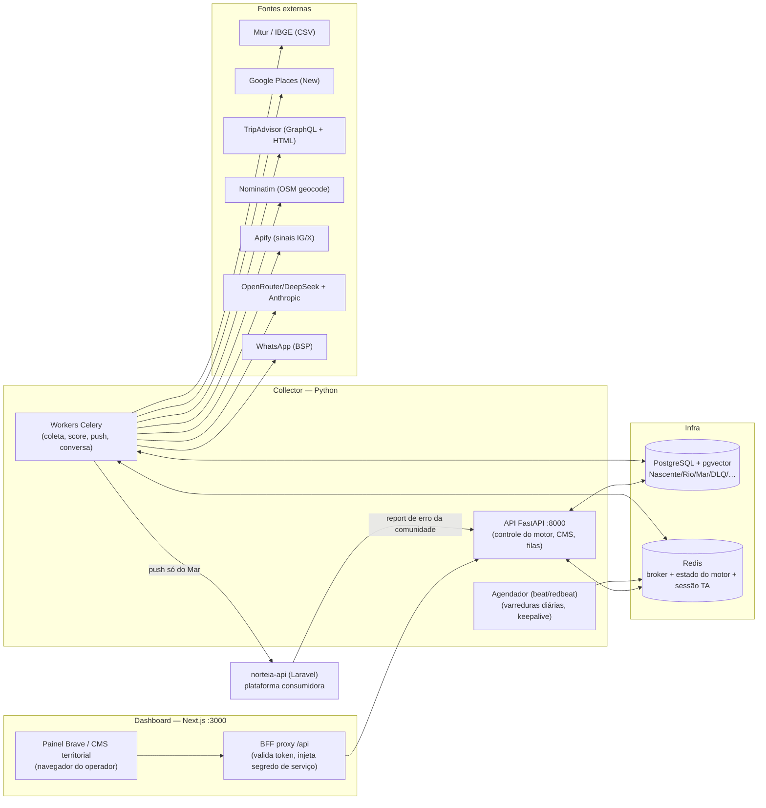
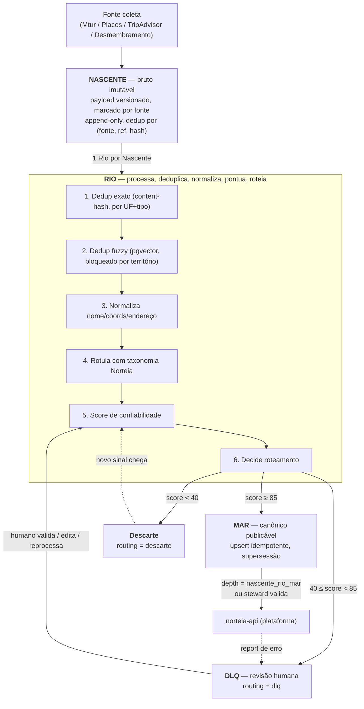
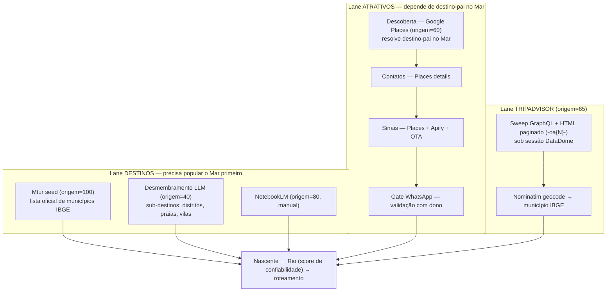
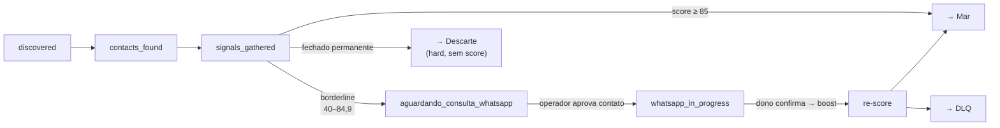
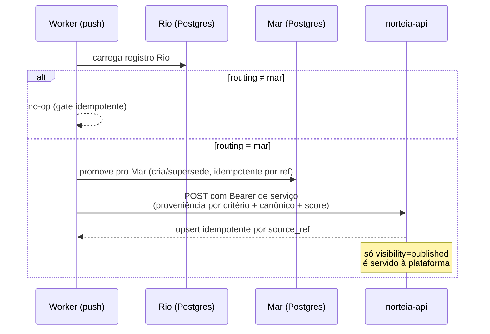
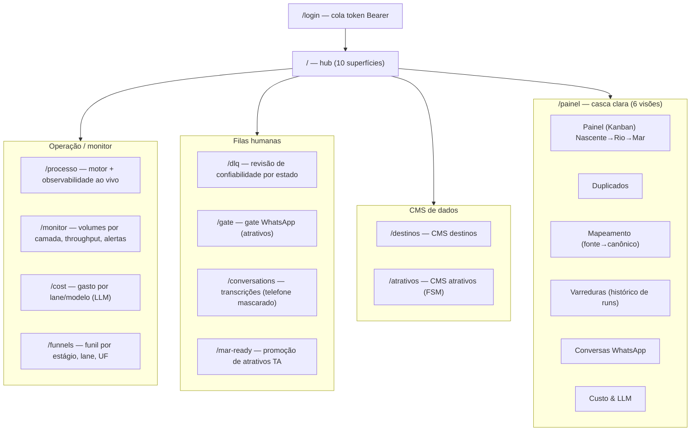
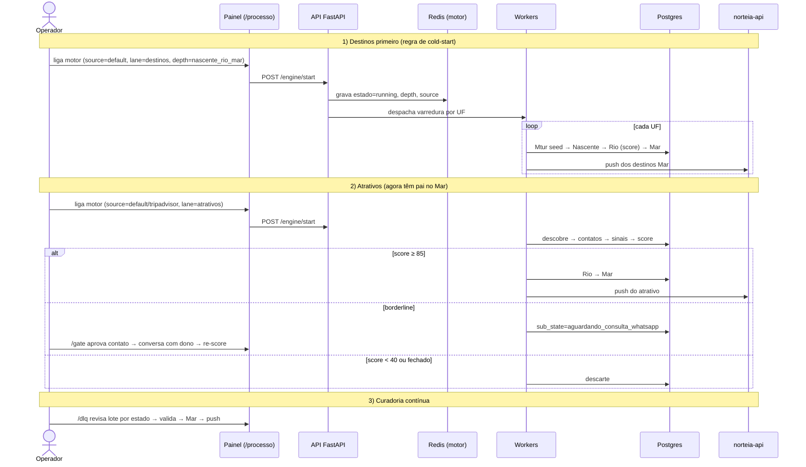

# Fluxo Operacional do Pipeline Brave

> Documento de **regra de negócio, serviços e fluxo de operação** do `norteia-brave`.
> Descreve como o sistema funciona hoje (frontend + backend), sem nomes de classes ou funções.
> Base: leitura do código, sessões de trabalho e memórias do projeto. Data: 2026-07-01.

---

## 1. O que é o Brave

O Brave é a **Pipeline Brave (Collector)** da Norteia: um serviço 24/7 que **descobre, limpa, deduplica, normaliza, pontua e publica** dados territoriais turísticos de todo o Brasil (27 UFs), a partir de uma carga inicial fria.

Regra soberana do negócio: **só chega na plataforma (`norteia-api`) o que for validado e confiável.** A publicação é governada por um **score de confiabilidade** e por uma **fila de revisão humana (DLQ)** — não por "aprovar tudo na mão".

O modelo é um **pipeline medalhão** de três camadas, com o vocabulário de rio:

```
Nascente  →  Rio  →  Mar
(bruto)     (processa)  (canônico publicável)
```

Duas saídas laterais dentro do Rio: **DLQ** (revisão humana) e **Descarte** (rejeitado). Uma quarta trilha, separada, é a **Quarentena Poison** (falha operacional de engenharia, ≠ DLQ territorial).

---

## 2. Arquitetura de serviços (o que roda)



**Papéis:**

| Serviço | Responsabilidade |
|---|---|
| **API FastAPI** (`:8000`) | Controle do motor (start/stop/source), CMS territorial, filas DLQ/Gate, status, logs, sessão TA. |
| **Workers Celery** | Toda a coleta, scoring, dedup, push e conversa WhatsApp. Fila **única** `celery` (sem roteamento por filas dedicadas — adiado até haver bloqueio de cabeça-de-linha). |
| **Agendador (beat/redbeat)** | Varreduras diárias por UF, descoberta de atrativos, keepalive de sessão TA. Schedule persistido no Redis, líder único. |
| **Dashboard Next.js** (`:3000`) | Painel operacional / CMS. Não fala direto com o FastAPI: passa por um **BFF proxy** que valida o token do operador e injeta o segredo de serviço. |
| **PostgreSQL + pgvector** | Uma tabela por camada + dedup vetorial + estado + auditoria. |
| **Redis** | Broker do Celery, resultado, agenda, **estado do motor** (`brave:*`), sessão DataDome do TripAdvisor, contadores de custo/rate-limit. |

**Como sobem (local, sem VPS):**
```
uvicorn (API)  ·  celery worker (fila celery, sem -Q)  ·  celery beat (agenda)  ·  next (dashboard)
```

---

## 3. Fluxo de dados — Nascente → Rio → Mar

Este é o núcleo. Cada camada é **uma tabela própria** (não um campo "status" numa mega-tabela). DLQ e Descarte são **valores de roteamento dentro do Rio**.



**Regras por camada:**

- **Nascente ("a nascente"):** payload bruto imutável, versionado, marcado por fonte. Append-only. Idempotente por `(fonte, ref, content_hash)`. Dado novo **supersede** o antigo (nunca muta no lugar). Guarda `entity_type` (destination/attraction), `uf`, payload JSONB.

- **Rio ("o rio"):** área de trabalho mutável. Um registro Rio por registro Nascente. Roda a esteira: dedup exato → dedup fuzzy → normaliza → rotula → **score** → **roteamento**. O campo `routing` é a decisão central:
  - `in_progress` — em processamento
  - `mar` — score ≥ 85% → elegível para publicação
  - `dlq` — score 40–84,9% → fila de revisão humana (com `dlq_reason`)
  - `descarte` — score < 40% → rejeitado
  - Atrativos ainda carregam um `sub_state` (máquina de estados, ver §6).

- **Mar ("o mar"):** único que sai do Brave. Recebe registros Rio com `routing='mar'`. Upsert idempotente por referência de fonte; unicidade só em linhas ativas; atualização por supersessão (linha nova ativa, aponta a antiga). Guarda o canônico + a proveniência completa (breakdown do score + linhagem).

- **DLQ (revisão de confiabilidade):** **não é tabela** — é `routing='dlq'` no Rio. Registros na fronteira (40–84,9%) que precisam de validação humana. Revisados em lote por estado no dashboard. Validação humana = boost no score → re-score → Mar.

- **Descarte:** `routing='descarte'` (score < 40%). Rejeitado; pode ser reprocessado se surgir sinal novo.

- **Quarentena Poison:** trilha **separada** — tarefas/registros que falharam permanentemente (payload malformado, retries esgotados, geocode não resolvido, destino-pai ausente). É problema de **engenharia**, não de curadoria territorial. Guarda tarefa + mensagem de erro + payload.

**Tabelas de apoio/observabilidade:** histórico de varreduras (runs), gerações de LLM (custo), log de auditoria (decisões do steward), log de consentimento (LGPD/opt-out por telefone), mensagens de conversa (transcrição WhatsApp mascarada).

---

## 4. Score de Confiabilidade — a regra de promoção

O score é uma **função pura** (sem I/O). Cinco critérios ponderados, cada um 0–100:

| Critério | Peso | O que mede |
|---|---:|---|
| **origem** | 30% | Autoridade da fonte |
| **completude** | 20% | Preenchimento dos campos |
| **corroboração** | 20% | Confirmação cruzada entre fontes |
| **atualidade** | 15% | Recência do dado |
| **validação humana** | 15% | Curadoria confirmada |

**Autoridade de origem embutida por fonte:**

| Fonte | origem | Papel |
|---|---:|---|
| Mtur (governo) | **100** | Semente autoritativa de municípios |
| NotebookLM | 80 | Relatório estruturado (manual) |
| TripAdvisor | 65 | Atrativos |
| Google Places | 60 | Descoberta de atrativos |
| Desmembramento (LLM) | 40 | Sub-destinos descobertos por LLM — "firewall": nunca auto-promove |

**Limiares de roteamento (configuráveis):**
- score ≥ **85,0** → `mar`
- score ≥ **40,0** → `dlq`
- score < **40,0** → `descarte`

**Por que o piso do DLQ é 40 e não 51:** registros de Desmembramento entram frios em origem=40, corroboração=0, sem validação humana → teto ≈47. Com piso 51 cairiam todos no descarte (um "buraco negro"). Baixar para 40 os manda pro DLQ, onde um steward pode revisar. (Versão do score marcada `v1.1` por essa recalibração. Limiares ainda **provisórios** — recalibrar sobre dados reais da BA antes do fan-out nacional.)

**Override `mar_ready` (só atrativos TripAdvisor):** um atrativo pode ser marcado promovível mesmo fora do caminho normal quando é atração TA **e** atualidade ≥ 70 **e** corroboração ≥ 60. Nunca vale para Mtur/Places.

**Significado de negócio do roteamento:**
- **Mar (≥85):** confiável para publicar. Na prática, dado frio raramente bate 85 sem validação humana — então normalmente chega ao Mar *depois* do DLQ (ou via override `mar_ready`).
- **DLQ (40–84,9):** "temos candidato, um humano precisa confirmar/completar." Validação humana (=100 nesse critério) re-pontua acima de 85 → Mar.
- **Descarte (<40):** ainda não vale revisar.

---

## 5. O Motor (engine) — como a coleta é disparada

O motor é um **controle start/stop no Redis** sobre a varredura. A plataforma roda 24/7, mas o motor fica **ocioso por padrão** — nada faz fan-out até um operador ligar.

```mermaid
stateDiagram-v2
    [*] --> idle
    idle --> running: POST /engine/start<br/>(exige depth; valida source;<br/>TA exige sessão viva)
    running --> stopping: POST /engine/stop
    stopping --> idle: termina UF atual,<br/>drena enfileiradas,<br/>não abre novas UFs
    running --> idle: 27/27 UFs despachadas
    running --> idle: falha de sessão TA (403/429)<br/>→ needs_bootstrap, motor OFF
```



**Estados** (`brave:engine:state`): `idle` | `running` | `stopping`. Stop é **gracioso**: termina de despachar a UF corrente, drena o que já foi enfileirado (sem abrir novas UFs) e volta a `idle`.

**Depth = a trava de gasto** (até onde a corrida vai):
- `nascente` — só ingest + score de confiabilidade. **Grátis** (sem Places, sem LLM).
- `nascente_rio` — + validação Places/LLM até o roteamento do Rio (**pago**), mas não aciona a cadeia do gate WhatsApp de atrativos.
- `nascente_rio_mar` — pipeline completo, incluindo o push idempotente pro Mar.

O depth é lido **uma vez** na borda autenticada do `/start` e passado como argumento da tarefa — nunca relido do Redis no meio da corrida (para que um valor mutado no Redis não escale gasto).

**Source** (`brave:engine:source`): `default` (Mtur/Desmembramento + descoberta Places) | `tripadvisor` (trilha de sweep TA).
**Lane:** `destinos` | `atrativos` | `both`.

**Uma "varredura" (sweep):** uma corrida do orquestrador que itera as UFs-alvo. Para cada UF: checa o estado do motor (para se não for `running`), despacha a(s) tarefa(s) produtora(s) conforme source/depth/lane, marca a UF despachada e dorme alguns segundos antes da próxima. Ele só **despacha** — nunca espera os workers.

**UFs:** todas as 27 (AC, AL, AM, AP, BA, CE, DF, ES, GO, MA, MG, MS, MT, PA, PB, PE, PI, PR, RJ, RN, RO, RR, RS, SC, SE, SP, TO) ou um subconjunto que o operador escolher.

**Três gatilhos, todos caindo nas mesmas tarefas produtoras:**
1. **Start manual pela API** (`/engine/start`) — grava um registro de varredura (runs) e despacha a corrida.
2. **Agendador (beat)** — sweep por UF de madrugada + descoberta de atrativos (escalonados para evitar contenção no banco) + keepalive TA a cada ~10 min para renovar a sessão DataDome. É o que sustenta a coleta 24/7.
3. **Tarefas auto-encadeadas** — a FSM de atrativos avança sozinha (descoberta → contatos → sinais).

**Chaves de estado no Redis (`brave:*`):** estado, UF atual, UFs feitas/total, depth, source, enabled (intenção do operador), run_id, sinal de bootstrap TA (`brave:ta:needs_bootstrap`), sessão TA (`brave:ta:session`), progresso do sweep nacional TA (`brave:ta:sweep:progress`).

---

## 6. Lanes de coleta



### Lane Destinos (tem de popular o Mar primeiro)
- **Mtur seed** (origem=100): re-ingesta a lista oficial de municípios do Ministério do Turismo. Idempotente. CSV ausente = erro permanente → poison. É o universo autoritativo de destinos (5570 municípios IBGE vendorizados) — não depende do TripAdvisor.
- **Desmembramento** (origem=40, "firewall"): descoberta recorrente por LLM de sub-destinos *dentro* de um município (distritos, praias, vilas) com nome/tipo/posicionamento turístico. Nunca auto-promove; cai no DLQ para revisão em lote por estado → Mar.
- **NotebookLM** (origem=80): ingest de relatório estruturado — só manual, fora do sweep recorrente.

### Lane Atrativos (depende de Destinos no Mar — regra de cold-start)
Máquina de estados (`sub_state`):



- **Descoberta (Places):** busca por UF, **resolve o destino-pai a partir do Mar** (pré-condição dura), extrai o atrativo por LLM (só `place_id` é persistido do Google — regra de ToS), semeia `discovered`. Teto de completude 75 antes de enriquecer.
- **Contatos (Places details):** avança para `contacts_found`; guarda telefone normalizado.
- **Sinais (Places + Apify + OTA):** avança para `signals_gathered` e pontua.
  - Estabelecimento `CLOSED_PERMANENTLY`/`CLOSED_TEMPORARILY` → **descarte duro** antes de qualquer score.
  - atualidade pela recência das reviews Places (≤30d → 100; 1–6m → 50; >180d → 0).
  - corroboração via Apify (ex.: atividade no Instagram) → 40 se confirmado.
  - Se borderline (<85%) → `aguardando_consulta_whatsapp` (gate humano).
- **Gate WhatsApp (LangGraph):** conversa de validação com o dono (existe? funciona? horário? preço?). Confirmação = boost de validação → re-score → Mar/DLQ. Sob compliance BSP (templates, janela 24h, opt-out, consentimento consultado antes de cada envio).

### Lane TripAdvisor (só atrativos)
- Raspa atrativos via GraphQL (queries persistidas) + HTML paginado (`-oa{N}-`), atrás de uma **sessão DataDome** injetada por operador. Dois modos: **por-UF** (precisa do mapa de destinos-pai do Mtur/IBGE no Rio) e **bulk nacional** (~334 páginas, sem pai). Resume do offset salvo. **TA não produz destinos** (a query nunca foi capturada) — só atrativos.
- **Geoids validados:** os 27 geoIds de estado foram corrigidos (2026-07-01) — cada um canonicaliza para `State_of_<UF>`. A AttractionsFusion geo-escopa corretamente por geoId; há retry limitado para um transiente (HTTP 200 com `success==false` + `totalResults=0` num geoId válido).
- **Linkagem atrativo→município:** uma query GraphQL entrega o nome do município-pai + UF direto; resolve pra IBGE com dobra de acento (NFKD). Coords opcionais.
- **Nominatim (geocode OSM):** enriquece cartões TA que erraram a resolução IBGE → resolve lat/lon + município. Endpoint público, **≤1 req/s** (intervalo 1,1s), cache de 30 dias (inclusive negativo), User-Agent identificável.

### Regra de cold-start (crítica)
Atrativos **não entram sem um destino-pai já no Mar.** Se a descoberta não acha destino ativo no Mar para a UF/município → **quarentena poison** (`parent_destino_absent`) e pula. O operador **precisa rodar um sweep de destinos (Mtur seed) antes de qualquer sweep de atrativos**, ou toda atração vai pra quarentena. (No bulk nacional TA o gate de pai é removido; nesse caso um cartão sem geocode vai pra quarentena como `ibge_unmatched`.)

---

## 7. Deduplicação (no Rio)

Duas etapas, **bloqueadas por território**:
1. **Exato:** match de content-hash, escopo `(uf, entity_type)` — hit reusa o Rio existente.
2. **Fuzzy:** busca de vizinho mais próximo por distância de cosseno (pgvector), **só dentro do mesmo bloco `(uf, municipio_id, entity_type)`**. Candidatos acima de similaridade **0,95** = duplicata.

Regra: **nunca comparar vetores entre UFs** — evita colisão de municípios homônimos (São Domingos/BA vs São Domingos/SE). O dashboard mostra os "pares de dedup" para o steward resolver (Mesclar / Manter ambos / Descartar).

> **Estado atual:** os embeddings são um **stub (vetor-zero)** — o dedup fuzzy está estruturalmente ligado mas ainda não produz similaridade real (adiado). O dedup exato funciona.

---

## 8. Publicação no norteia-api (Laravel)



**Quando:** um registro Rio chega a `routing='mar'` e o depth é `nascente_rio_mar` (ou um steward valida um DLQ → push).
**Contrato (testado por Pact):** proveniência plana por critério (`origem, completude, corroboração, atualidade, validação_humana`) + fonte, referência, tipo, canônico, score, versão. O norteia-api faz upsert idempotente por referência de fonte — **sem staging; o Mar já é canônico.**
**Gate reverso:** o botão "reportar erro" da comunidade no norteia-api → webhook (segredo compartilhado) → reabre o registro Rio ligado como `routing='dlq'` com motivo `community_error_report`.

---

## 9. Orquestração assíncrona (Celery — fila única)

**Modelo de fila única:** todas as tarefas (beat + disparo direto) caem na fila padrão `celery`. Sem roteamento por filas, sem pools dedicados (adiado até haver bloqueio de cabeça-de-linha). Confiabilidade: confirmação tardia, rejeita em perda de worker, limite de tempo 300s, uma tarefa estável por vez.

**Classificação de erro (toda tarefa):** erro transiente → retry com backoff (máx. 3); erro permanente → quarentena poison; qualquer exceção após o máximo de retries → quarentena poison. Toda tarefa é idempotente.

**Tarefas (papel de negócio):**

| Tarefa | Papel |
|---|---|
| Orquestrador de varredura | Fan-out por UF; honra depth/lane/source; drena no Stop; finaliza o registro de runs. |
| Sweep de destinos (por UF) | Mtur seed + Desmembramento. |
| Sweep TripAdvisor | Atrativos TA (por-UF ou bulk); em 403/429 → fail-fast, marca bootstrap, desliga o motor. |
| Descoberta de atrativo (por UF) | Places; encadeia contatos quando depth completo. |
| Contatos / Sinais | Avançam a FSM de atrativos. |
| Processa Nascente | Roda um registro pela esteira do Rio (score + roteia). |
| Reprocessa registro | Re-pontua (mudança de config, nova corroboração, validação humana, reabertura por erro). |
| Push (Mar/destino/atrativo) | Promove pro Mar + publica no norteia-api. |
| Conversa (outreach/retomar) | Turnos da conversa de validação WhatsApp (LangGraph). |
| Keepalive TA | Renova a sessão DataDome periodicamente. |

---

## 10. Frontend — Painel / CMS territorial

O dashboard tem **duas cascas coexistentes**:
- **10 rotas "dark" legadas** — uma página por superfície operacional, a partir de um hub inicial com token.
- **A casca clara `/painel` ("Painel Brave")** — uma rota só, com **6 visões** por estado local, redesenho leve de CMS (escopo `.painel-light`, sem virar o tema global).



**Superfícies e o que o operador faz:**

| Tela | Domínio | Ação do operador |
|---|---|---|
| **/processo** | Monitor ao vivo | Liga/desliga o motor (depth, source, escopo de UF); vê progresso do sweep TA nacional, workers/filas, pendências DLQ/Gate, funil por sub-estado, falhas recentes. Polling de 10s. |
| **/monitor** | Monitor Brave | Tiles de volume por camada + taxa de aprovação/rejeição/DLQ, gráfico de throughput, alertas de falha. |
| **/dlq** | Revisão de confiabilidade | Fila por UF em ordem de prioridade (BA/RJ/SP/SC/CE/PE), lote "Validar {UF}"; painel de review com breakdown do score, Nascente bruto, Rio normalizado, sinais, auditoria → **Validar e publicar / Reprocessar / Rejeitar**. |
| **/gate** | Gate WhatsApp | Fila de atrativos em `aguardando_consulta_whatsapp`; aprova contato (→ outreach) ou rejeita. |
| **/mar-ready** | Promoção TA | Atrativos TA que bateram os limiares Mar-Ready, promoção manual (individual + lote). |
| **/destinos**, **/atrativos** | CMS | Lista/detalhe com ações por estágio (promover, reprocessar, editar, descartar; atrativo avança FSM). |
| **/cost** | Custo/LLM | Gasto por lane e por modelo, janela de tempo. |
| **/funnels** | Funil | Barras por estágio (ingerido → em progresso → mar/dlq/descarte) por lane e UF. |
| **/conversations** | Transcrições | Uma conversa por registro, telefone mascarado (LGPD). |

**Painel Kanban (a visão principal do redesenho):** board de 6 colunas — `Nascente` · `Rio · validação` · `WhatsApp · contato` · `Mar · publicado` · `DLQ · revisão` · `Falha`. Cartões vêm de destinos + atrativos (limite 500) + falhas (quarentena) + Nascente bruto. Cartões Nascente são **read-only** (nascente→rio é automático) e mostram o **município** ao lado da UF. **Windowing:** cada coluna renderiza até 100 cartões, +50 por scroll; a contagem sempre mostra o total real. **Arrastar = mutação** por uma allow-list fechada (espelha as arestas permitidas no servidor), via um endpoint genérico auditado com concorrência otimista; arestas ausentes revertem com toast.

**Autenticação:** operador cola um token Bearer (persistido no navegador). Todo request vai a uma URL relativa `/api/...` — **nunca direto ao FastAPI**. Um **BFF proxy** (catch-all no servidor Next) valida o token do operador em tempo constante e **antes** de encaminhar, depois injeta o segredo de serviço (que nunca chega ao navegador) e encaminha só para a base fixa do FastAPI (seguro contra SSRF). Por isso os logs mostram `/api/api/v1/...` — o BFF está montado em `/api` e o caminho do FastAPI já começa com `/api/v1`.

---

## 11. Fluxo operacional ponta a ponta

Sequência típica de uma corrida limpa (carga inicial de uma UF):



**Ordem obrigatória:** **destinos no Mar antes de atrativos.** Rodar atrativos numa base vazia manda tudo pra quarentena `parent_destino_absent`.

**Reset (carga inicial fria):** limpar a base zera todas as tabelas de dados (mantém schema + versão de migração), esvazia as chaves `brave:*` do Redis e purga a fila do broker. Depois disso o motor mostra ocioso com contagens zeradas.

---

## 12. Estado atual e problemas conhecidos

| Item | Situação |
|---|---|
| **Nominatim 429** | **Bug vivo.** O geocode público OSM tem limite ~1 req/s por IP; múltiplos workers em paralelo estouram → `429 Too many requests`. O cliente tem self-rate-limit (1,1s), cache 30 dias e retry com backoff (máx. 3), mas sob 429 sustentado o cartão TA não resolve → vai pra **quarentena poison** (`ibge_unmatched`). No último teste, uma varredura TA nacional mandou **240 registros** pra quarentena, 100% por 429 do Nominatim — nada chegou ao Nascente. Mitigar: throttle global (semáforo Redis 1 req/s), Nominatim self-hosted, ou provider pago. |
| **Embeddings** | Stub (vetor-zero). Dedup fuzzy ligado mas sem similaridade real. |
| **Push sem DLQ de retry** | Falha permanente de push só **loga** — não re-enfileira. DLQ de retry adiado. |
| **Fragilidade da sessão TA** | 403/429/DataDome no meio do sweep para a corrida, marca `needs_bootstrap` e **desliga o motor**; operador precisa reinjetar uma sessão fresca (cURL de um navegador humano real) antes de reiniciar. Sessão dura ~30 min < corrida completa (~3h). |
| **Limiares do score provisórios** | Piso do DLQ recalibrado 51→40 (buraco negro do Desmembramento). Recalibrar sobre dados reais da BA antes do fan-out nacional. |
| **TA não produz destinos** | A query de destinos nunca foi capturada; TA = só atrativos. Destinos vêm do Mtur/IBGE (autoritativo, resolvido). |
| **Webhook WhatsApp sem verificação de assinatura** | TODO de produção (Twilio) pendente. |
| **Beat re-dispara varreduras atrasadas** | Ligar o beat re-dispara crontabs diários vencidos na hora (redbeat) → inunda sweeps de todas as UFs. Para testes controlados, rodar só o worker. |

---

### Anexo — vocabulário de referência

- **Camadas:** Nascente · Rio · Mar (+ DLQ / Descarte como roteamento; Quarentena Poison à parte)
- **Roteamento (Rio):** `in_progress` · `mar` · `dlq` · `descarte`
- **Estados do motor:** `idle` · `running` · `stopping`
- **Depth:** `nascente` · `nascente_rio` · `nascente_rio_mar`
- **Source:** `default` · `tripadvisor` · **Lane:** `destinos` · `atrativos` · `both`
- **Sub-estado do atrativo:** `discovered` · `contacts_found` · `signals_gathered` · `aguardando_consulta_whatsapp` · `whatsapp_in_progress`
- **Fontes / origem:** mtur (100) · notebooklm (80) · tripadvisor (65) · places (60) · desmembramento (40)
